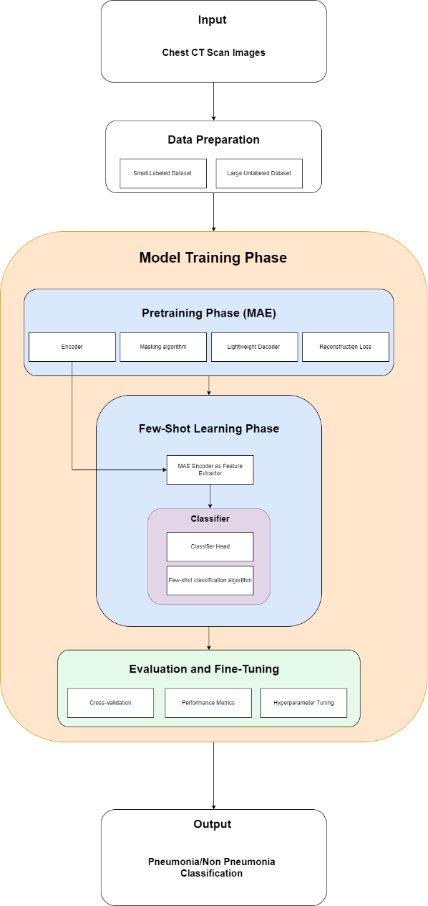

# MFCT

MFCT - Detection of Pneumonia from Chest CT using Advanced Deep Learning Methodologies.

This project presents an AI-driven approach to pneumonia detection using chest CT scans, combining pre-trained masked autoencoders (MAE) with few-shot learning techniques. By extracting meaningful features from images and enabling accurate classification with minimal labeled data, the method addresses the challenge of data scarcity in medical diagnostics and aims to support faster, more reliable pneumonia diagnosis in clinical settings.

Dataset Link: [COVID-19&Normal&Pneumonia_CT_Images](https://www.kaggle.com/datasets/anaselmasry/covid19normalpneumonia-ct-images?select=pneumonia_CT)

## Architecture 

The proposed architecture for pneumonia detection combines Masked Autoencoders (MAE) for self-supervised pretraining with a Few-Shot Learning approach for classification. This hybrid design allows the model to leverage a large set of unlabelled chest CT scans to learn general, high-quality feature representations using MAE, and then adapt to a small labelled dataset for accurate pneumonia classification. The architecture is divided into four sequential phases: Dataset Preparation, Pretraining with MAE, Few-Shot Learning, and Evaluation and Fine-Tuning.

<p align="center">
  
</p>


During the pretraining phase, a large portion of each image is masked, and the MAE encoder (based DenseNet121) is trained to reconstruct the missing parts using a lightweight decoder and MSE loss. This enables the encoder to learn robust, meaningful visual features from chest CT images. In the few-shot learning phase, the pretrained encoder serves as a fixed feature extractor, and a few-shot classification algorithm—paired with a simple classifier head—is applied to the small labelled dataset. Finally, evaluation and fine-tuning involve cross-validation, performance metric analysis, and hyperparameter tuning to optimize the model’s performance in low-data medical imaging scenarios

## Environment Setup

Before running any code or notebooks, set up the environment using Conda to ensure compatibility.

Use the provided `environment.yml` file to create the environment:

```bash
conda env create -f environment.yml
conda activate mfct-env
```

This replicates the exact package configuration required for the project.


## Dataset Preparation

### Raw Dataset Preparation

1. Download the dataset from the above link.
2. Create a directory named `Datasets` in the root directory of the project.
3. Extract the dataset to the `Datasets` directory and rename the extracted directory to `Dataset_O`.

```bash
MFCT
├── Datasets
│   ├── Dataset_O
```

### Dataset Creation

The following steps are performed to create a large unlabelled dataset and a small labelled dataset from the original dataset.

1. First 500 images from each class are selected and copied to a new directory named `Dataset_S` in the same sub-directory structure as `Dataset_O`. Also apply data preprocessing steps.

2. Exclude the first 500 images from each class and copy the remaining images to a new directory named `Dataset_L`. Also apply data preprocessing and augmentation steps.

### Data Preprocessing

1. Resize the images to 224x224 pixels.
2. Sharpen(Enhance) the images.

### Data Augmentation

The following data augmentation techniques are applied to the images in `Dataset_L`.

#### Geometric Transformations

1. Horizontal Flip
2. Translation
3. Random Scaling

#### Intensity Transformations

1. Gaussian Noise
2. Contrast Adjustment
3. Brightness Adjustment
4. Gamma Correction

#### Other Transformations

1. Elastic Deformation
2. Gaussian Blur
3. Salt and Pepper Noise

## Metadata Structure

The metadata for `Dataset_L` includes detailed information about the augmentations applied to each image in the dataset. This information is stored in a JSON file named `augmentation_metadata.json`, located in the `.\Dataset` directory of the project.

### Metadata File Location

```bash
.\Dataset\augmentation_metadata.json
```

### JSON Structure

The metadata is organized as a dictionary where each key is an image name and each value is another dictionary that specifies the transformations applied to that image. The structure is as follows:

```json
{
    "image_name": {
        "transformation_1_name": "type",
        "transformation_2_name": "type"
    }
}
```

### Example

An example entry in the augmentation_metadata.json file might look like this:

```json
{
    "204 (10)_5981.jpg": {
        "gaussian_blur": "other",
        "horizontal_flip": "geometric"
    },
    "204 (11)_5982.jpg": {
        "horizontal_flip": "geometric",
        "gauss_noise": "noise",
        "elastic_transform": "other",
        "random_gamma": "color"
    },
}
```

### Field Descriptions

- `image_name`: The name of the image file in the dataset.
- `transformation_name`: The name of the transformation applied to the image. It can be one of the following:
  - `horizontal_flip`
  - `shift_scale_rotate`
  - `gauss_noise`
  - `gaussian_blur`
  - `brightness_contrast`
  - `random_gamma`
  - `elastic_transform`
  - `gaussian_blur`
- `type`: The category of the transformation. It can be one of the following:
  - `geometric`
  - `color`
  - `noise`
  - `other`


## Notebooks to Explore

To understand the workflow and results, refer to the following notebooks:

- `chestct_mae_fewshot.ipynb`: Main notebook demonstrating the few-shot learning approach on Chest CT images using masked autoencoders.
- `visualization.ipynb`: Visual analysis of masked autoencoders on Chest CT images, showing performance results for masking ratios from 75% to 95% in 5% increments.


## Acknowledgements

This repository is a fork of [lambert-x/medical_mae](https://github.com/lambert-x/medical_mae), which itself is based on code from [facebookresearch/mae](https://github.com/facebookresearch/mae).  
The original `mae` repository is licensed under the Creative Commons Attribution-NonCommercial 4.0 International License.  
This project inherits that license.

## License

This project is licensed under the Creative Commons Attribution-NonCommercial 4.0 International License (CC BY-NC 4.0).  
You may share and adapt the material, but commercial use is not permitted.  
Full license text available in the LICENSE file.
